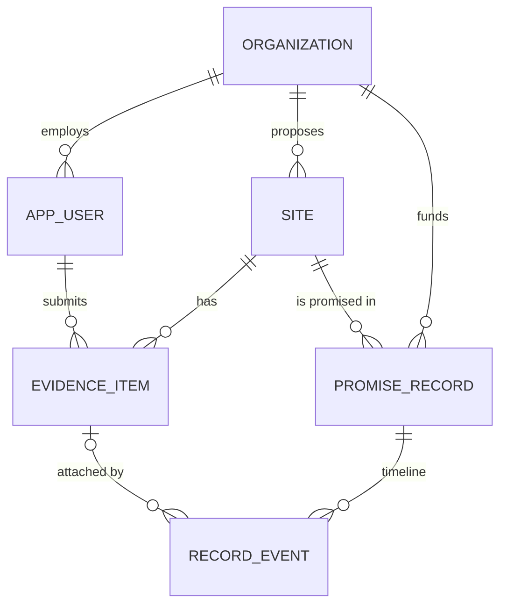

# Data Model — Mangrove

> **Purpose:** the entities Mangrove stores, every field, and the constraints PostgreSQL itself enforces —
> including the append-only guarantee behind BR-002. Classification lives in
> [`security.md` §3](security.md); each field here only names its category.
> Traces back to: [`system-design.md`](system-design.md). Traces forward to: [`api.md`](api.md),
> [`tests.md`](tests.md).

Engine: PostgreSQL with PostGIS, hosted on Neon (ADR-036). Geometries are stored as `geometry(…, 4326)` (WGS 84 lon/lat); areas are
always computed on `geography` casts (EQ-001). No code exists yet — once `db/init/*.sql` is written, that
file is authoritative and this doc follows it.

## 1. Entity Relationships

An evidence item always belongs to a site. It joins a record's timeline only through a `record_event`, so
"which evidence is on this record" has one home: the timeline. An item submitted after a lock therefore also
informs the site's three answers, which is intended.

## 2. Entities & Fields

### organization

**Stored in:** table `organization` · **Written by:** seed script (no API writes)

| Field | Type | Null? | Default | Class | Description |
|-------|------|-------|---------|-------|-------------|
| `id` | `uuid` | no | `gen_random_uuid()` | public | Stable identifier |
| `name` | `text` | no | — | public | Organization name; fictional for demo orgs (BR-006) |
| `kind` | `org_kind` (`funder` \| `partner`) | no | — | public | What the organization does in Mangrove |
| `is_demo` | `boolean` | no | `true` | public | Shows the "Demo data" label (BR-006) |

### app_user

**Stored in:** table `app_user` · **Written by:** seed script (no self-signup)

| Field | Type | Null? | Default | Class | Description |
|-------|------|-------|---------|-------|-------------|
| `id` | `uuid` | no | `gen_random_uuid()` | internal | Stable identifier |
| `org_id` | `uuid` | no | — | internal | Organization the user acts for |
| `email` | `citext` | no | — | **PII** | Sign-in identifier |
| `display_name` | `text` | no | — | **PII** | Shown on evidence the user submits |
| `role` | `user_role` (`funder` \| `partner`) | no | — | internal | Authorization role ([`security.md` §4](security.md)) |
| `password_hash` | `text` | no | — | **secret** | Password hash (algorithm in [`security.md` §7](security.md)); the plain password is never stored |
| `created_at` | `timestamptz` | no | `now()` | internal | When the account was seeded |

### site

**Stored in:** table `site` · **Written by:** seed script; Evidence API (F-014, Could)

| Field | Type | Null? | Default | Class | Description |
|-------|------|-------|---------|-------|-------------|
| `id` | `uuid` | no | `gen_random_uuid()` | public | Stable identifier |
| `name` | `text` | no | — | public | Site display name |
| `region` | `text` | no | — | public | e.g. `Manila Bay` — groups the candidate set |
| `geom` | `geometry(MultiPolygon, 4326)` | no | — | public | Candidate boundary; area derived by EQ-001, never stored |
| `proposal_summary` | `text` | yes | `null` | public | The proposer's claim about the site, in their words; null if none submitted |
| `proposed_by_org_id` | `uuid` | yes | `null` | public | Proposing organization; null for team-drawn demo polygons |
| `is_demo` | `boolean` | no | `true` | public | BR-006 |
| `created_at` | `timestamptz` | no | `now()` | public | When the site entered Mangrove |

`site` is the one mutable table among the core entities. A record never depends on the live row: the
geometry and name are copied into the record snapshot at lock time.

### evidence_item — append-only

**Stored in:** table `evidence_item` · **Written by:** Source adapters (GMW ingest, Sentinel-2 refresh) and the Evidence API (field submissions, project reports)

| Field | Type | Null? | Default | Class | Description |
|-------|------|-------|---------|-------|-------------|
| `id` | `uuid` | no | `gen_random_uuid()` | public | Stable identifier |
| `site_id` | `uuid` | no | — | public | The site this evidence is about |
| `question` | `question` (`history` \| `current` \| `ground` \| `work` \| `outcome`) | no | — | public | Which site question or record check it answers (PRD §4.1 vocabularies) |
| `source_type` | `source_type` (`gmw` \| `sentinel2` \| `field` \| `project_report` \| `proposal`) | no | — | public | Kind of source |
| `source_name` | `text` | no | — | public | e.g. `Global Mangrove Watch`, `Copernicus Sentinel-2 L2A`, partner org name |
| `source_version` | `text` | yes | `null` | public | e.g. `v4.1.12`; null for field submissions |
| `observed_from` | `timestamptz` | no | — | public | Start of the observation (equals `observed_to` for a single moment) |
| `observed_to` | `timestamptz` | no | — | public | End of the observation window |
| `retrieved_at` | `timestamptz` | no | `now()` | public | When Mangrove obtained it |
| `location` | `geometry(Geometry, 4326)` | yes | `null` | public | GPS point or mapped boundary; null when the item covers the whole site polygon |
| `finding` | `text` | yes | `null` | public | One value from the question's vocabulary; null only when `usable = false` |
| `metrics` | `jsonb` | no | `'[]'` | public | Array of `{name, value, unit, eq_id, confidence}` — every stored number names its `EQ-###` ([`methods.md`](methods.md)) |
| `method` | `text` | no | — | public | How the finding was produced, in one line |
| `spatial_resolution_m` | `numeric` | yes | `null` | public | Pixel size for raster sources; null otherwise |
| `limitation` | `text` | no | — | public | What this source cannot tell you |
| `provenance_url` | `text` | yes | `null` | public | Link to the dataset, document or request record |
| `asset_sha256` | `char(64)` | yes | `null` | public | Uploaded photo or document; S3 key `assets/<sha256>` (ADR-037) |
| `asset_mime` | `text` | yes | `null` | public | `image/jpeg` or `image/png` |
| `raw` | `jsonb` | yes | `null` | internal | Source response as received (e.g. Statistical API JSON), kept for audit |
| `usable` | `boolean` | no | — | public | False excludes it from statuses (BR-001) |
| `unusable_reason` | `text` | yes | `null` | public | Required when `usable = false` |
| `note` | `text` | yes | `null` | public | Submitter's free-text observation; must not contain personal data ([`security.md` §6](security.md)) |
| `submitted_by_user_id` | `uuid` | yes | `null` | internal | Null for adapter-generated items |
| `submitted_by_org_id` | `uuid` | yes | `null` | public | Organization credited as the source; null for adapter items |
| `is_demo` | `boolean` | no | `true` | public | BR-006 |
| `created_at` | `timestamptz` | no | `now()` | public | When the item was appended |
| `content_hash` | `char(64)` | no | — | public | EQ-011 over the item's canonical JSON |

### promise_record — append-only

**Stored in:** table `promise_record` · **Written by:** Record ledger

| Field | Type | Null? | Default | Class | Description |
|-------|------|-------|---------|-------|-------------|
| `id` | `uuid` | no | `gen_random_uuid()` | public | Stable identifier; part of the public URL |
| `site_id` | `uuid` | no | — | public | The chosen site |
| `funder_org_id` | `uuid` | no | — | public | Who made the promise |
| `created_by_user_id` | `uuid` | no | — | internal | Who pressed confirm |
| `rationale` | `text` | no | — | public | Why this site |
| `planned_action` | `planned_action` (`planting` \| `natural_regeneration` \| `hydrological_repair` \| `protection` \| `other`) | no | — | public | Intervention type [ADR-025] |
| `planned_action_detail` | `text` | no | — | public | What will be done |
| `planned_area_ha` | `numeric(10,2)` | no | — | public | Area the funder commits to work on |
| `expected_outcome` | `text` | no | — | public | What should happen, in words |
| `expected_vegetated_ha` | `numeric(10,2)` | yes | `null` | public | Optional measurable outcome for EQ-012; null means the outcome check relies on field evidence only |
| `work_check_after` | `date` | no | — | public | When "did the work happen?" becomes checkable |
| `outcome_check_after` | `date` | no | — | public | Before this date the outcome check reads "too early to tell" |
| `known_unknowns` | `text` | no | — | public | What the funder did not know yet |
| `snapshot` | `jsonb` | no | — | public | Site name + GeoJSON geometry + area (EQ-001) + every evidence item `{id, content_hash, question, finding, usable}` + the three answers at lock time |
| `idempotency_key` | `text` | no | — | internal | Client-supplied key; one record per key |
| `is_demo` | `boolean` | no | `true` | public | BR-006 |
| `published_at` | `timestamptz` | no | `now()` | public | Publication moment |
| `content_hash` | `char(64)` | no | — | public | EQ-011 over every field above except `id`, `idempotency_key` and `content_hash` |

### record_event — append-only

**Stored in:** table `record_event` · **Written by:** Record ledger

| Field | Type | Null? | Default | Class | Description |
|-------|------|-------|---------|-------|-------------|
| `id` | `uuid` | no | `gen_random_uuid()` | public | Stable identifier |
| `record_id` | `uuid` | no | — | public | The record whose timeline this extends |
| `seq` | `integer` | no | — | public | 1, 2, 3… per record; gap-free |
| `kind` | `event_kind` (`evidence_added` \| `correction`) | no | — | public | What happened |
| `evidence_item_id` | `uuid` | yes | `null` | public | Required when `kind = evidence_added`; null for corrections |
| `body` | `jsonb` | yes | `null` | public | Correction text `{field, text}`; null for evidence events |
| `created_by_user_id` | `uuid` | no | — | internal | Who appended it |
| `created_at` | `timestamptz` | no | `now()` | public | When it was appended |
| `prev_hash` | `char(64)` | no | — | public | The record's `content_hash` for `seq = 1`, else the previous event's `event_hash` |
| `event_hash` | `char(64)` | no | — | public | EQ-011 chained hash |

Statuses, findings per question, pin state and areas are **not stored**: the engine derives them on every read
from the append-only rows (BR-001, BR-004). A stored status would be a mutable copy of a derived fact.

## 3. Constraints & Indexes

| Entity | Constraint / Index | Type | Why it exists |
|--------|--------------------|------|---------------|
| all | `pk_<table>` on `id` | primary key | Identity |
| app_user | `fk_app_user_org` → organization | foreign key, `restrict` | A user acts for one organization |
| app_user | `uq_app_user_email` | unique | One account per email; sign-in lookup |
| site | `fk_site_proposer` → organization | foreign key, `set null` | Proposer is optional |
| site | `ix_site_geom` | GiST | Map viewport queries |
| evidence_item | `fk_evidence_site` → site | foreign key, `restrict` | Evidence cannot outlive its site |
| evidence_item | `ck_evidence_finding` | check | `finding` is in the vocabulary for `question` (PRD §4.1) or null when unusable — BR-001 |
| evidence_item | `ck_evidence_unusable_reason` | check | `usable = true OR unusable_reason IS NOT NULL` |
| evidence_item | `ix_evidence_site_question` on `(site_id, question, created_at)` | index | Building a site's three answers — every dossier, compare and MCP read |
| evidence_item | `ix_evidence_location` | GiST | Spatial checks on field points/boundaries |
| promise_record | `fk_record_site` → site, `fk_record_funder` → organization | foreign key, `restrict` | A record's site and funder cannot be deleted |
| promise_record | `uq_record_idempotency_key` | unique | A double-submitted lock creates one record |
| promise_record | `ck_record_dates` | check | `outcome_check_after >= work_check_after` |
| promise_record | `ck_record_area` | check | `planned_area_ha > 0` |
| record_event | `fk_event_record` → promise_record, `fk_event_evidence` → evidence_item | foreign key, `restrict` | Timeline integrity |
| record_event | `uq_event_record_seq` on `(record_id, seq)` | unique | Gap-free, race-safe ordering; serves timeline reads |
| record_event | `ck_event_kind_payload` | check | `evidence_added` ⇒ `evidence_item_id` set; `correction` ⇒ `body` set |
| evidence_item, promise_record, record_event | `trg_<table>_append_only` | trigger `BEFORE UPDATE OR DELETE` raising an exception | **BR-002**: no update or delete, even from a buggy handler |
| evidence_item, promise_record, record_event | app database role granted `SELECT, INSERT` only | grant | **BR-002**: second layer; the app role cannot even issue `UPDATE`/`DELETE` |

`restrict` everywhere on the append-only side: a single delete must never cascade away a published promise.

## 4. Doc Integrity Check

- [x] Every entity in §1 has a field table in §2, and vice versa.
- [x] Every field has a PostgreSQL type and an explicit nullability answer.
- [x] Every non-internal field names a category defined in [`security.md` §3](security.md); none is defined here.
- [x] Every relationship has a foreign key with on-delete behaviour named.
- [x] Every index names the query it serves; BR-001 and BR-002 enforcement is named.
- [x] No validation rule, payload shape or retention period is restated here.
- [ ] **Stored because it might be useful later?** `evidence_item.raw` — kept for audit of external numbers; drop it if storage or exposure becomes a concern.

## References

- [`security.md`](security.md) — §3 categories, §7 password hashing and secrets.
- [`methods.md`](methods.md) — `EQ-###` named in `metrics` and hashes.
- [`api.md`](api.md) — payload shapes projected from these entities.
- [`prd.md` §4.1](prd.md) — BR-001…BR-006 and the finding vocabularies.
