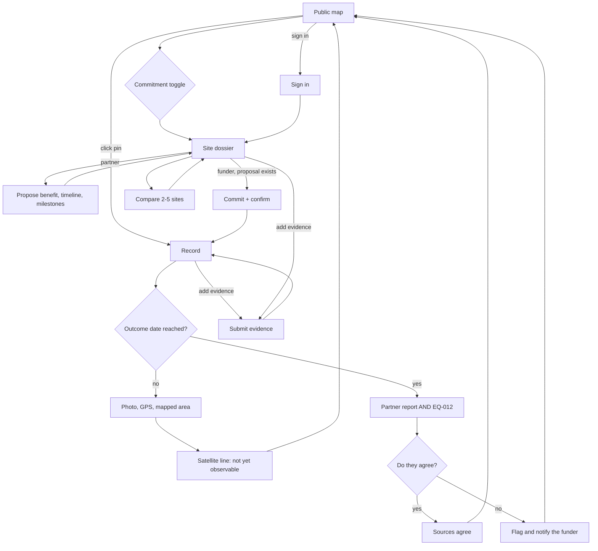

# PRD — Mangrove

> **Purpose:** what we build, for whom, and how a user moves through it. The team's primary build
> reference, and the doc to read first.
> Traces back to: [`idea.md`](../idea.md) §6, §7, §8, §10. Traces forward to: system design, data model,
> methods, API, security, tests, design brief.

## 1. Product Purpose & Value Proposition

Mangrove is a public map of mangrove sites and funding commitments in the Philippines. A partner proposes
a site, the benefit in their own words, a timeline and milestones. A funder commits to that proposal. Anyone
can open a site before a commitment exists, and the map toggles between sites with a commitment and sites
without one.

Each site still shows three answers — was this mangrove before (Global Mangrove Watch), what's there now
(Sentinel-2), what do people on the ground say — each marked supported, conflicting or missing, with no
invented success score. The benefit on the proposal is the partner's sentence. Mangrove does not compute
an environmental benefit.

After a funder commits, the public record keeps the partner's terms. An early milestone is checked with the
partner's photo, GPS and mapped area. The satellite line reads "not yet observable", and that is not a fail.
After the outcome date, both the partner's report and the Sentinel-2 vegetated area (EQ-012) are required.
If they disagree, the record is flagged and the funder is notified. The product does not declare fraud, send
an inspector, or apply a penalty, and it does not say the project was successful. The record footer says this
is not a certification. Maps and trackers show data; Mangrove publishes the partner's terms when a funder
commits, then shows whether those terms and the later check agree.

**Success is measured by** the targets in [`idea.md` §8](../idea.md) — not restated here.

## 2. Personas

| Persona | Role & context | Problem frequency | Today's workaround | Stories |
|---------|----------------|-------------------|--------------------|---------|
| **Funder** | CSR/sustainability manager at a Philippine company, or a foundation/NGO program officer, who commits money to a partner's proposal and is answerable to leadership and the public for the spend | Each funding cycle; defended for years after | Reads a partner's proposal, maybe a GMW map, then publishes a press release ("10,000 trees planted") | US-001, US-002, US-003, US-004, US-005, US-007, US-008, US-012, US-013, US-015 |
| **Field partner** | Field officer at a local NGO or people's organization who proposes a site, states the benefit, timeline and milestones, then visits, takes photos and maps planted areas | Per proposal and per site visit | Photos and spreadsheets sent to the funder privately; nothing public | US-006, US-010, US-016 |
| **Public reader** | Journalist, local government officer, auditor, community member or another funder checking a site or a commitment | Whenever a project is announced or questioned | Takes the press release at face value or files a request | US-001, US-009, US-011, US-012, US-014 |

*Market segments are not defined in this suite (no market doc; see [`idea.md` §2](../idea.md)).*

## 3. Feature Set & Priority

Features reuse the `F-###` IDs from [`idea.md` §7](../idea.md); none are minted here.

| `F-###` | Feature | Priority | Solves (problem) | Notes / why not |
|---------|---------|----------|------------------|-----------------|
| F-001 | Partner-proposed sites the public can open before a commitment. The demo set is 3–5 Manila Bay polygons | Must | No common starting set | Demo sites are labelled demo (BR-006) |
| F-002 | Evidence dossier with full provenance per item | Must | Scattered evidence | BR-005 |
| F-003 | Source adapters: GMW history (pre-ingested), Sentinel-2 now (live + snapshot fallback) | Must | Manual reconciliation | Equations in [`methods.md`](methods.md). GMW is history, not a completion check |
| F-004 | Field evidence submission (photo, GPS, observation, mapped area) | Must | Map-only screening misses fishponds and land conflicts | Early milestones use these inputs only |
| F-005 | Three-question assessment, each supported / conflicting / missing | Must | Hidden disagreement | BR-001, BR-003 |
| F-006 | Side-by-side comparison of 3–5 sites | Must | Choosing what to fund | |
| F-007 | Funder commits to a partner proposal; the public terms lock | Must | No baseline | BR-002. Benefit text is the partner's words |
| F-008 | Public map that toggles sites with a commitment and sites without one | Must | Sites and promises can't be found | BR-004 |
| F-009 | Milestone checks: field-only before the outcome date; partner report and EQ-012 after it | Must | Nobody checks | BR-001. Satellite line "not yet observable" is not a fail |
| F-010 | Disagreement flags the record, turns the pin red, and notifies the funder | Must | Deviations stay hidden | BR-001, BR-004, BR-007 |
| F-011 | Amazon Quick analyst over a read-only MCP server | Must | Manual analyst work | Hard requirement ([`context.md`](../context.md)) |
| F-012 | Record integrity check | Should | "Can't be edited" must be checkable | |
| F-013 | In-app plain-language evidence summary | Could | Dense dossiers | BR-003; LLM provider TBD |
| F-014 | Upload a new candidate polygon | Could | Limited to pre-loaded sites | Waits on the core loop |
| F-015 | Success score / probability | Won't | — | Reason: fake precision [ADR-023, ADR-028]. Reconsider if: a validated outcome model exists. |
| F-016 | AlphaEarth embeddings | Won't | — | Reason: not interpretable; costs time. Reconsider if: core loop done early. |
| F-017 | Live ODK Central integration | Won't | — | Reason: later integration. Reconsider if: a partner already uses ODK. |
| F-018 | MRTT import | Won't | — | Reason: no documented live API. Reconsider if: a partner exports MRTT data. |
| F-019 | Billing / subscriptions | Won't | — | Reason: willingness to pay untested. Reconsider if: a funder commits to pay. |
| F-020 | Sentinel-1 radar | Won't | — | Reason: optional. Reconsider if: clouds block every Sentinel-2 window. |
| F-021 | Private funder shortlists | Won't | — | Reason: public reads keep Quick's MCP unauthenticated; demo data is public-source. Reconsider if: a paying funder needs confidentiality. The private object that does exist is the funder-partner contract (see [`security.md`](security.md)), not a hidden shortlist. |
| F-022 | Inspector dispatch | Won't | — | Reason: the product stops at the flag and the funder notice. Sending people is the funder's action under the private contract (ADR-024, ADR-044). Reconsider if: a funder asks the product to dispatch. |
| F-023 | Penalties applied in the product | Won't | — | Reason: consequences stay in the private contract (ADR-024). Reconsider if: a funder asks the product to apply a penalty. |
| F-024 | Crowdsourced public evidence | Won't | — | Reason: roadmap, not this cycle. Reconsider if: after the demo, with a protocol for what a public submission must contain. |

| Tier | Means | QA obligation |
|------|-------|---------------|
| **Must** | no point shipping without it | ≥1 test case |
| **Should** | important; core value survives one release without it | ≥1 test case |
| **Could** | wanted if time allows | may defer, with the reason stated in the QA plan |
| **Won't** | decided against for now | excluded — the row records a decision |

## 4. User Stories & Acceptance Criteria

**US-001 — Browse sites with and without a commitment** *(F-001, F-008)* — Priority: Must
> As a **Public reader**, I want to see the Manila Bay sites on a map and in a list, including sites no
> funder has committed to, so that I can open a proposal before a commitment exists.

- Given 3–5 seeded sites, some with a commitment and some without, when I open the sites screen without signing in, then each site appears as a polygon on the map and as a list row showing its name, its area in hectares (EQ-001), and whether it has a commitment.
- Given a site is demo data, when it is displayed anywhere, then it carries a visible "Demo data" label (BR-006).

**US-002 — Inspect a site's evidence dossier** *(F-002, F-003)* — Priority: Must
> As a **Funder**, I want every piece of evidence about a site in one place with where it came from so
> that I can judge how much to trust it.

- Given a site with evidence items, when I open its dossier, then every item shows its source, source version, observed date, retrieved date, method, spatial resolution (when applicable), limitation, and a link or attached asset (BR-005).
- Given the Global Mangrove Watch snapshot was pre-ingested, when I open any demo site's dossier, then it contains a GMW item with the site's historical mangrove area per year and its maximum historical extent (EQ-002, EQ-003). That item is history. It is not a completion certificate.
- Given an evidence item is not usable (e.g. too few cloud-free pixels, EQ-005), when it is displayed, then it is marked "not usable" with the reason, and it is excluded from status calculations (BR-001).

**US-003 — See the three answers for a site** *(F-005)* — Priority: Must
> As a **Funder**, I want each of the three questions answered with an honest status so that I can see
> what the evidence agrees on, what it disputes, and what is unknown.

- Given a site dossier, when it renders, then it shows three questions — "Was this mangrove before?", "What's there now?", "What do people on the ground say?" — each with its finding, a status of supported, conflicting or missing (BR-001), and the number and dates of the sources behind it.
- Given no usable evidence for a question, when it renders, then the status is "missing" and no finding is shown.
- Given any site, when it renders, then no overall score, rank or probability is shown (F-015 is Won't).

**US-004 — Compare sites side by side** *(F-006)* — Priority: Must
> As a **Funder**, I want to compare 2–5 sites in columns so that I can see which differences matter.

- Given I select 2–5 sites, when I open the comparison, then each site is a column with its area, its three answers (finding + status + source count) and its open conflicts, in the order I selected.
- Given I select fewer than 2 or more than 5 sites, when I try to compare, then the comparison does not open and I am told the allowed range.

**US-005 — Refresh current-condition evidence from Sentinel-2** *(F-003)* — Priority: Must
> As a **Funder**, I want to pull the latest satellite condition for a site so that "what's there now" is
> current.

- Given Copernicus is reachable, when I request a refresh for a site, then a new Sentinel-2 evidence item is appended with its acquisition window, valid-pixel fraction (EQ-005) and class fractions (EQ-006), and the "What's there now?" status recomputes.
- Given Copernicus fails or times out, when I request a refresh, then no new item is created, I am told the live source failed, and the dossier keeps showing the stored snapshot item with its date.

**US-006 — Submit field evidence** *(F-004)* — Priority: Must
> As a **Field partner**, I want to upload what I saw at a site so that ground truth sits next to the
> satellite evidence.

- Given I am signed in as a partner, when I submit a photo (JPEG or PNG), GPS point, observation date, a finding from the fixed list and an optional mapped boundary for a site or record, then a field evidence item is appended with me and my organization as the source.
- Given I upload a photo, when it is stored, then its embedded metadata (EXIF) is removed, and the location shown is the GPS point I entered.
- Given I am not signed in as a partner, when I try to submit, then the submission is rejected.

**US-007 — Commit to a partner proposal** *(F-007)* — Priority: Must
> As a **Funder**, I want to commit to a partner's proposal before money moves so that the public terms
> stay the words the partner wrote.

- Given I am signed in as a funder and the site has a partner proposal and no commitment, when I confirm the commit, then I am shown a final confirmation stating the record can never be edited or deleted.
- Given I confirm, when the record is created, then it is published at a public URL with its publication time, my organization, the partner's benefit text, timeline and milestones, a snapshot of the site geometry and of every evidence item and status at that moment, and a content hash (BR-002). The benefit text is the partner's words. No computed environmental benefit is stored.
- Given the site has no partner proposal, when I try to commit, then nothing is published.

**US-008 — A published record cannot change** *(F-007)* — Priority: Must
> As a **Funder**, I want my published promise to be impossible to quietly edit so that its credibility
> holds — including against me.

- Given a published record, when anyone tries to change or delete it or its evidence through the product, then the attempt is refused and the record is unchanged (BR-002).
- Given I need to correct a mistake, when I add a correction, then it appears as a new dated entry on the record's timeline and the original text stays visible.

**US-009 — Toggle sites with and without a commitment** *(F-008)* — Priority: Must
> As a **Public reader**, I want to toggle sites with a commitment and sites without one so that I can
> open a proposal or a locked record without an account.

- Given sites exist, some with a published record and some without, when I open the map without signing in, then I can show sites with a commitment, sites without one, or both. A site with a commitment has one pin, coloured by pin state (BR-004).
- Given I open a site with no commitment, when the page renders, then I see the partner's proposal and no locked record.
- Given I click a pin, when the record opens, then I can read the promise, its evidence snapshot, its milestone reports and both checks.

**US-010 — Add later evidence to a record** *(F-009)* — Priority: Must
> As a **Field partner**, I want to add new evidence to an existing record so that the promise is checked
> against what actually happened.

- Given a published record, when a partner submits field evidence or a funder submits a project report (with claimed area and work date), then it is appended to the record's timeline with its provenance, and the original promise and earlier entries stay unchanged (BR-002, BR-005).

**US-011 — See the milestone gate** *(F-009)* — Priority: Must
> As a **Public reader**, I want an early milestone and the outcome check shown as different tests so
> that a missing satellite reading is not a failure, and activity is not confused with recovery.

- Given a record whose outcome date has not arrived, when an early milestone renders, then the allowed inputs are the partner's photo, GPS and mapped area, the satellite line reads "not yet observable", and that line is not a fail (BR-001).
- Given the outcome date has passed, when the outcome check renders, then both the partner's report and the Sentinel-2 vegetated area (EQ-012) are required. If either is absent, the check is missing. It is not supported.
- Given both required outcome inputs are present and agree, when the outcome check renders, then the status is supported, the finding is shown, and the page does not say the project was successful and does not certify (BR-007).

**US-012 — Disagreement is flagged and the funder is notified** *(F-010)* — Priority: Must
> As a **Public reader**, I want a disagreement on a record to be obvious, and as a **Funder** I want to
> be told, so that the deviation is visible to everyone and the notice reaches the account that committed.

- Given a record where a reported area and a mapped area differ by more than the tolerance (EQ-009), when it renders, then the work check shows "conflicting" with both values and their sources, and the record's pin is red (BR-004). This comparison is the report against the partner's mapped area, not a satellite count of seedlings.
- Given the outcome date has passed and the partner's report disagrees with EQ-012, when the record renders, then the outcome check shows "conflicting", the pin is red, and the funder account is notified (BR-007).
- Given an early milestone has no satellite observation, when it renders, then the record is not flagged for that absence.
- Given a disagreement is flagged, when the record renders, then the page does not state fraud, name an inspector, or apply a penalty (BR-007).
- Given conflicting evidence within one of the three site questions, when that site or record renders, then the question shows "conflicting" and lists the disagreeing items.

**US-013 — Ask Amazon Quick why two sites differ** *(F-011)* — Priority: Must
> As a **Funder**, I want to ask a Quick agent "why does Site A differ from Site B?" so that I get a
> source-grounded explanation without reading every item.

- Given the Mangrove MCP server is connected to Amazon Quick, when I ask why two named sites differ, then the agent's answer cites findings, statuses and evidence sources returned by the tools, and every number it repeats matches the tool output.
- Given a tool is asked to change data, when Quick calls the server, then no write tool exists to call (the server is read-only).

**US-014 — Verify a record is intact** *(F-012)* — Priority: Should
> As a **Public reader**, I want to check that a record has not been altered since publication so that
> "can't be edited" is something I can confirm.

- Given a published record, when I request verification, then the content hash and every timeline entry hash are recomputed and I see "intact" or the first entry that does not match.

**US-016 — Propose a site** *(F-001, F-007)* — Priority: Must
> As a **Field partner**, I want to propose a site with the benefit in my words, a timeline and milestones
> so that a funder can commit to terms I stated.
- Given I am signed in as a partner and the site has no proposal, when I submit benefit text, a timeline and at least one milestone, then the site is publicly readable with that text, timeline and milestones, and it has no commitment.
- Given the proposal is shown, when a reader opens the site, then the benefit is the partner's words and no computed environmental benefit is shown.
- Given I am not signed in as a partner, when I try to submit a proposal, then the submission is rejected.

**US-015 — Read a plain-language summary** *(F-013)* — Priority: Could
> As a **Funder**, I want a short plain-language summary of a dossier so that I can brief my leadership.

- Given a site dossier, when I request a summary, then it is generated only from the dossier's items and statuses, is labelled as AI-generated, and states no status or number that the dossier does not contain (BR-003).

### 4.1 Cross-cutting rules (`BR-###`)

| `BR-###` | Rule | Invoked by |
|----------|------|------------|
| BR-001 | **Status = agreement among usable evidence.** For each site question and each record check: no usable item → *missing*; all usable items give the same finding → *supported*; usable items give different findings (or a reported vs measured area differs beyond tolerance, EQ-009) → *conflicting*. "Supported" means sources agree on the finding, not that the site is good. The finding is always shown with the status. Before the outcome date, the satellite line on an early milestone is *not yet observable* and is not a fail. After that date, the outcome check is supported only when the partner's report and EQ-012 are both present and agree. One without the other is *missing*, not supported. | US-002, US-003, US-011, US-012, US-013 |
| BR-002 | **Append-only.** A published record, its evidence items and its timeline entries are never updated or deleted. Corrections and new evidence are new, dated entries. | US-007, US-008, US-010 |
| BR-003 | **Deterministic decisions; the model only narrates.** Statuses, findings, pin states and numbers come from source data and the rules in [`methods.md`](methods.md). An LLM (Quick or in-app) may summarize them; it never sets a status or introduces a number. | US-003, US-013, US-015 |
| BR-004 | **Pin state precedence.** Red (conflict) if any check or site question on the record is conflicting; otherwise "awaiting evidence" if a check is missing or the satellite line is not yet observable; otherwise "on track". A satellite line of "not yet observable" does not by itself turn the pin red. Colours other than red belong to the design doc. Sites with no commitment are polygons, not record pins. | US-001, US-009, US-012 |
| BR-005 | **Provenance-first evidence.** Every evidence item carries source, source version, observed and retrieved time, geometry or location, question, finding, value and unit where applicable, method (with its `EQ-###` when computed), spatial resolution where applicable, limitation, link or asset, submitter, and a content hash. | US-002, US-005, US-006, US-010 |
| BR-006 | **Demo data is labelled.** Every seeded site, organization, record and evidence item that is not real is flagged demo and shows a "Demo data" label wherever it appears, including in MCP tool output. Demo organizations use fictional names. | US-001, US-009, US-013 |
| BR-007 | **Flag and notice, then stop.** A disagreement sets *conflicting* and notifies the funder account on that record. The product does not declare fraud, dispatch an inspector, apply a penalty, or say the project was successful. Consequences stay in the private contract. The page does not certify. | US-011, US-012 |

**Finding vocabularies (fixed lists, per question):**

| Question / check | Findings |
|------------------|----------|
| Was this mangrove before? | `mangrove_recorded` · `no_mangrove_recorded` |
| What's there now? | `mostly_vegetation` · `mostly_bare_soil` · `mostly_water` |
| What do people on the ground say? | `open_for_restoration` · `active_fishpond` · `land_use_dispute_reported` · `existing_mangrove` |
| Did the work happen? | `work_done` · `no_work_seen` (plus area consistency, EQ-009) |
| Did the mangroves come back? | `recovery_seen` · `no_recovery_seen` (plus expected vs measured vegetated area, EQ-008/EQ-009) |

## 5. App Flow & UX Intent

**Design reference:** [`design.md`](design.md). Visual stack: Next.js (App Router) + MapLibre GL JS.

### 5.1 Screen Inventory

| Screen | Purpose | Entry points | States to design |
|--------|---------|--------------|------------------|
| Public map | Toggle sites with a commitment and sites without one; open either (US-001, US-009) | App launch `/`, shared link | loading / empty / error / with commitment / without commitment / both |
| Record | Read a commitment, its evidence snapshot, timeline, milestone checks, flag, integrity (US-008, US-011, US-012, US-014) | Pin click, shared URL, after commit | loading / not found / error / intact / conflict / not yet observable |
| Sign in | Funder or partner signs in (US-005, US-006, US-007, US-016) | "Sign in" link; any write action while signed out | idle / submitting / wrong credentials / error |
| Sites | Browse Manila Bay sites on map + list, with or without a commitment (US-001) | Map, "Sites" link | loading / empty / error / populated |
| Site dossier | Three answers, GMW history, the partner proposal, all evidence; refresh Sentinel-2; start a commit (US-002, US-003, US-005, US-015, US-016) | Site row or polygon click | loading / error / refreshing / live-source-failed / proposed / committed |
| Compare | 2–5 sites in columns (US-004) | "Compare" from the site list | loading / invalid selection / error / populated |
| Propose | Partner writes benefit text, timeline and milestones (US-016) | "Propose" on a dossier (partner only) | editing / validation error / error / published |
| Commit | Confirm the partner's terms; irreversible confirmation (US-007) | "Commit" on a dossier that has a proposal (funder only) | editing / validation error / confirming / publishing / error |
| Submit evidence | Partner or funder adds evidence to a site or record (US-006, US-010) | "Add evidence" on dossier or record | editing / uploading / validation error / error / done |
| Amazon Quick chat (external) | Ask why sites differ (US-013) | Amazon Quick console | (owned by Quick) |

### 5.2 App Flow

**Linear (primary path):**

`Public map (toggle) → Site dossier → Propose → Commit → Record → early milestone (photo, GPS, mapped area; satellite line "not yet observable") → after the outcome date, partner report and EQ-012 → disagreement flags the record and notifies the funder`

| Flow concern | Detail |
|--------------|--------|
| Entry points | `/` (public map); shared site or record URL; sign-in link; Amazon Quick (external) |
| Decision branches | Toggle (with a commitment, without one, or both); role (partner proposes and submits field evidence; funder commits, refreshes Sentinel-2, and submits a project report); outcome date reached or not; the two outcome inputs agree or not; Copernicus reachable or not |
| Dead ends | None. Every screen links back to the map or the site list |
| Abandonment / resume | An unconfirmed commit is not saved; nothing is published until confirmation. A submitted proposal and submitted evidence are saved immediately |
| Edge cases | No sites yet (empty map with an explanation); a site with no proposal cannot be committed; Copernicus down (snapshot); all pixels cloudy (item "not usable"); outcome date in the future (satellite line "not yet observable", not a fail); duplicate commit (one record only, see `api.md`); disagreement does not dispatch anyone and does not apply a penalty |

### 5.3 Onboarding Flow

- **Aha / first-value moment:** in the comparison, a site that looks restorable on Global Mangrove Watch
  shows a conflicting ground answer, a partner reports an active fishpond, which the map alone does not
  show [R09]. The same pass shows an early milestone whose satellite line is "not yet observable", which
  is not a fail.
- **Time-to-first-value target:** under 2 minutes in the demo, using pre-seeded sites and evidence.
- **Skippable / resumable:** the public map needs no sign-in; funder/partner flows use seeded demo accounts.
- **Friction budget:** none for public readers; one sign-in for funders and partners.

### 5.4 UX Constraints

- Every status shows its finding, source count and source dates — met by rendering the BR-001 inputs alongside the status, never the status alone.
- Every record shows "This record is not a certification of restoration success or approval of funding" — met by a fixed record footer.
- Demo content is always labelled — met by the `is_demo` flag on every entity (BR-006).
- Live satellite calls must not block the demo — met by a stored Sentinel-2 snapshot per site and an explicit refresh action rather than fetching on page load.
- Laptop/projector browser is the primary surface; the public map and record pages must also read on a phone `[assumption]`.

### 5.5 Instrumentation & Event Taxonomy

| Event name | Fires when | Key properties | Feeds metric |
|------------|-----------|----------------|--------------|
| `comparison_opened` | A comparison renders | site_count, ts | Activation |
| `promise_locked` | A record is published | record_id, site_id, ts | Activation |
| `evidence_added` | An evidence item is appended to a record | record_id, source_type, ts | Retention |
| `record_viewed` | A record page renders | record_id, signed_in (bool), ts | Value (public reach) |

**Naming convention:** snake_case `object_action`, past tense, no PII in properties.
**Analytics tool:** TBD — server logs are enough for the demo.

## 6. Non-Goals

See [`idea.md` §10](../idea.md) for scope exclusions. Rejected features are `Won't` rows in §3.

- No overclaiming copy: the claim boundaries in [`idea.md` §9](../idea.md) "Avoid" apply to every screen, the pitch and Quick's agent instructions. Revisit only with new evidence. The product does not say "successful" and does not certify.
- No inspector dispatch (F-022). The product flags the record and notifies the funder account. It does not send people. Revisit if a funder asks the product to dispatch.
- No penalty in the product (F-023). Consequences stay in the private contract [ADR-024]. The product does not notify regulators. Revisit if a funder asks the product to apply a penalty.
- No crowdsourced public evidence this cycle (F-024). Revisit after the demo.
- No marketplace fee for listing a proposal. Brokering stays out of scope in [`idea.md` §10](../idea.md).
- No regions beyond the Manila Bay demo area are seeded for the hackathon. Revisit after the demo.

## 7. Dependencies & Open Questions

**Dependencies**

- Copernicus Data Space account with an OAuth client (Sentinel Hub Statistical API) [R32].
- Global Mangrove Watch v4.1.12 extent stack, downloaded before ingest [R31].
- Amazon Quick access with MCP integration enabled (requires an Enterprise subscription per AWS docs) [R35].
- A public HTTPS URL for the MCP endpoint (Quick connects to remote servers only) [R35].
- Display map: Google Maps JavaScript API (2D satellite; 3D site and record views) when a browser key is configured, for display only; no evidence, measurement or status comes from Google imagery (ADR-046). Without a key, the fallback below.
- Basemap tiles for MapLibre (the fallback): EOxCloudless 2016 (`https://tiles.maps.eox.at/wmts/1.0.0/s2cloudless_3857/default/g/{z}/{y}/{x}.jpg`, CC BY 4.0; attribution "EOxCloudless https://cloudless.eox.at by EOX IT Services GmbH (Contains modified Copernicus Sentinel data 2016)"). Later vintages are CC BY-NC-SA and are not used.
- 3–5 demo site polygons and their demo field evidence, authored by the team.

**Open questions**

- Does the handbook's pre-built-product rule allow specs and docs written before the build window? — resolved by asking organizers. `[assumption]` that planning docs are allowed; no code exists before the window.
- Exact build window (10 PM–10 AM) and team cap — resolved by organizers' on-site schedule [context tab §1].
- Rubric weights and Grand Finals criteria — resolved by organizers before the semifinal.
- The demo conflict "8 ha versus 5 ha" is a reported area against a GPS-mapped area, not a satellite reading of seedlings. Closed by ADR-033.
- Threshold values (`HISTORY_MIN_FRACTION`, `MIN_VALID_FRACTION`, `AREA_TOLERANCE`, Sentinel-2 window) — resolved by the data lead and recorded in [`methods.md`](methods.md); all are `[assumption]` until then.
- Include the Global Mangrove Alliance restoration-potential layer [R04] as a fourth evidence source? — resolved by the data lead only if the three-source loop is done.
- ~~Hosting target and basemap provider~~ — resolved: AWS EC2 + Caddy at `https://18-140-211-157.sslip.io` ([`system-design.md`](system-design.md) §6, ids in [`ledger.md`](ledger.md) §1); basemap EOxCloudless 2016 (above). Database Neon (ADR-036), photos S3 (ADR-037).
- LLM provider for F-013 (Could) — resolved only if F-013 is started.

## 8. Doc Integrity Check

- [x] Every `F-###` here exists in [`idea.md` §7](../idea.md) with the same ID and MoSCoW tier.
- [x] Every `US-###` names ≥1 real `F-###`; every Must/Should feature is covered (F-001…F-012, including US-016 on F-001 and F-007).
- [x] Story priorities are never stricter than their feature's.
- [x] Every `US-###` has at least one observable Given/When/Then.
- [x] Every persona has ≥1 story; every story names a defined persona.
- [x] Every `BR-###` is invoked by ≥2 stories.
- [x] Every screen in §5.1 is reachable in §5.2 and lists its states.
- [x] No security rule, metric target, route or NFR number is restated here.
- [ ] **Load-bearing and untested:** funders want a public, uneditable promise (idea §9); "supported" will be read as "good" despite BR-001's wording — watch this in the demo and copy.

## References

- [`idea.md`](../idea.md) — problem, segment, features, metrics, exclusions.
- [`index.md` §0](index.md) — which doc owns which fact.
- [`methods.md`](methods.md) — every `EQ-###` cited above.
- [`security.md`](security.md) — auth and threats. [`api.md`](api.md) — contracts. [`tests.md`](tests.md) — the `TC-###` per criterion.
- [`design.md`](design.md) — routes, states, pin colors. Tokens live in `brand/`.
- [`context.md`](../context.md) §7 — `[R##]` citations.
