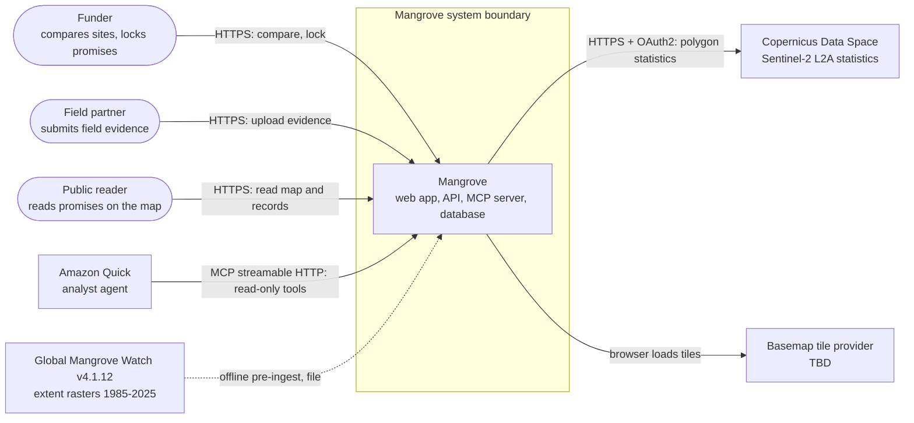
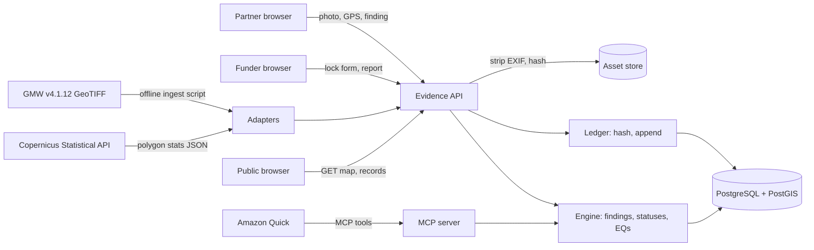
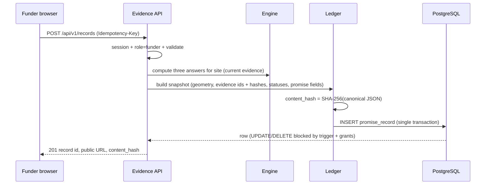

# System Design — Mangrove

> **Purpose:** how Mangrove is put together — components, data flow, technology choices and what each costs.
> Traces back to: [`prd.md`](prd.md). Traces forward to: [`data-model.md`](data-model.md),
> [`api.md`](api.md), [`methods.md`](methods.md), [`security.md`](security.md).

## 1. System Context

*Drawn as a flowchart rather than Mermaid's experimental `C4Context`, which most Markdown previewers do not render.*

Mangrove's boundary contains the web app, the API, the database and the asset files. Copernicus, Amazon
Quick and the tile provider are outside it, and their failures are handled in §5. Global Mangrove Watch is
never called at runtime: a script turns the downloaded rasters into evidence rows before the demo.

## 2. Components & Responsibilities

| Component | Responsibility | Owns | Depends on | Serves |
|-----------|----------------|------|------------|--------|
| **Web app** (`web/`, Next.js App Router + MapLibre GL JS) | All screens in PRD §5.1; proxies `/api/*` to the API so browser and API share one origin | Nothing persistent | Evidence API, tile provider | F-001, F-004, F-006, F-007, F-008, F-012, F-013, F-014 |
| **Evidence API** (`api/`, FastAPI) | REST endpoints, sessions and role checks, input validation, upload handling | The write path: no other component writes to the database | Engine, Record ledger, Adapters, PostgreSQL, Asset store | F-001…F-012, F-014 |
| **Evidence engine** (`api/engine/`) | Pure functions: findings, question/check statuses, pin state, every `EQ-###` | The decision rules (BR-001, BR-004) and their thresholds | Nothing (pure) | F-005, F-006, F-009, F-010 |
| **Record ledger** (`api/ledger/`) | Creates records and timeline entries, canonical-JSON hashing, hash-chain verification | Record immutability and integrity (BR-002) | PostgreSQL | F-007, F-009, F-012 |
| **Source adapters** (`api/adapters/`, `data/ingest/`) | GMW pre-ingest script (offline); Sentinel-2 live adapter with stored-snapshot fallback; field-upload normalizer | The mapping from raw source output to evidence items (BR-005) | Copernicus, GMW files, Engine | F-002, F-003, F-004 |
| **MCP server** (mounted in the API at `/mcp`) | Read-only tools for Amazon Quick over streamable HTTP | No data; calls the same read functions as the REST API | Engine, PostgreSQL | F-011 |
| **PostgreSQL + PostGIS** | Canonical store for sites, evidence, records, timeline, users | All structured data ([`data-model.md`](data-model.md)) | — | all |
| **Asset store** (filesystem volume, content-addressed by SHA-256) | Uploaded photos after metadata stripping | Photo bytes | — | F-004, F-009 |

The MCP server and the REST API are two interfaces to one set of read functions. A status Quick reports
is the same status the web page shows, because both call the engine. That is how BR-003 holds for Quick.

## 3. Data Flow

**Trust boundaries:** browser → API (all writes authenticated, all inputs validated); Copernicus → API
(external numbers enter as evidence items with provenance, never trusted as instructions); Quick → MCP
(read-only, no write path exists); partner photos → asset store (re-checked type, size cap, metadata
stripped). [`security.md` §5](security.md) builds its threat model on these boundaries.

**Lock sequence (the core write):**

## 4. Technology Choices & Trade-offs

| Choice | Why | Trade-off accepted | Alternative rejected | Authority |
|--------|-----|--------------------|----------------------|-----------|
| **Next.js (App Router) + MapLibre GL JS** for the web app | Map-first UI with polygons and pins; open-source map renderer | Two runtimes (TS + Python) in a 12-hour build | Leaflet — weaker vector-tile and styling support | Team product doc §8 |
| **FastAPI (Python)** for the API, engine and adapters | Geospatial ecosystem (raster ingest, geometry), auto-generated OpenAPI, official MCP Python SDK | A second deployable and language | Next.js-only: Sentinel-2 and MCP are plain HTTP, and only the offline GMW ingest truly needs Python. **Open challenge: collapsing to Next.js + one offline Python script would be simpler — revisit if the team has no Python-fluent builder.** | Team product doc §8 |
| **PostgreSQL + PostGIS** | Geodesic areas (`ST_Area` on geography), spatial joins, triggers for append-only rules, one store for everything | Must run PostGIS (container image) | SQLite/SpatiaLite — weaker role grants for immutability | Team product doc §8 |
| **Append-only tables + SHA-256 hash chain** for immutability | Enforced by database triggers and grants, checkable by anyone via EQ-011 | Tamper-evident, **not** tamper-proof: a database superuser could rewrite rows and hashes; residual risk stated in `security.md` | Blockchain anchoring — cost, wallet setup and explanation time with no demo payoff | Our judgment |
| **Sentinel-2 via Copernicus Statistical API** | Polygon statistics without downloading scenes [R32]; free tier 10,000 requests and 300 requests/min [CDSE quotas] | Needs OAuth credentials and network at demo time | Downloading and processing scenes locally — hours of work | Team ADR-030 |
| **SCL classes (vegetation / bare soil / water) for "what's there now"** | ESA's own Sen2Cor scene classification, so no NDVI thresholds are invented | 20 m classes; cannot tell mangrove from other vegetation; tide state changes the water fraction | NDVI/NDWI thresholds — numbers we would have to make up | Our judgment ([`methods.md`](methods.md)) |
| **GMW pre-ingested once** into evidence rows | No runtime dependency; GMW v4.1.12 is a static 41-band GeoTIFF [R31] | Snapshot ages; refresh = rerun the script | Live GMW API — none relied on | Team ADR-030 |
| **MCP server in the API, streamable HTTP, no auth** | Quick connects only to remote servers, prefers streamable HTTP, and supports unauthenticated servers [R35]; every exposed tool reads public data | Public endpoint must be rate-limited | OAuth for MCP — Quick supports it, but DCR or manual OAuth setup costs time for no data-protection gain | Amazon Quick MCP docs [R35] |
| **Filesystem asset store** (content-addressed) | One less service in 12 hours | Single host only | S3 — the target for a real deployment | Our judgment |

Kiro is the build environment and spec tool (`.kiro/specs/`), not a runtime component [R36].

## 5. Integration Points

| Service | Protocol | Failure mode | Our behaviour on failure |
|---------|----------|--------------|--------------------------|
| Copernicus identity + Statistical API | HTTPS, OAuth2 client credentials; `POST https://sh.dataspace.copernicus.eu/statistics/v1` | Timeout, 401 (expired token; tokens last minutes), 429 (quota), `status != OK`, all pixels cloudy (silent-poor) | Refresh token once on 401; on any other failure create no item and keep the stored snapshot (US-005); an all-cloud result becomes a "not usable" item (EQ-005), never a status |
| Amazon Quick → MCP | MCP over streamable HTTP | Quick times out after 5 minutes; rejects tool schemas that aren't JSON Schema Draft 7+; tools don't auto-resync after changes [R35] | Tools return in seconds from the database only (no live satellite calls); schemas emitted as Draft 7 with root-level `required`; after a tool change, press **Sync** in Quick |
| Basemap tile provider (TBD) | HTTPS tiles | Down or rate-limited | Map shows polygons and pins on a blank background; records remain readable |
| GMW v4.1.12 files | Local file, offline | Missing download | The ingest script fails loudly; history evidence is "missing" rather than invented |
| LLM for F-013 (TBD, Could) | HTTPS | Error or off-source text | Summary button shows "unavailable"; statuses are unaffected (BR-003) |

## 6. Deployment Topology

- One host running Docker Compose with three services — `web`, `api` (including `/mcp`), `db` (PostGIS) — plus a volume for assets. `[assumption]` host is TBD (an AWS instance fits the venue and Quick); decided at scaffold.
- A reverse proxy terminates HTTPS. The MCP endpoint must be reachable at a public `https://…/mcp` URL for Amazon Quick [R35].
- One environment for the hackathon (the demo). Local development uses the same Compose file.
- Secrets (Copernicus client, session signing key, demo account passwords) are environment variables on the host, never in the repo ([`security.md` §7](security.md)).

## 7. Scaling Strategy & Non-Functional Risk

- **What scales, and how:** nothing needs to for the demo (3–5 sites, a handful of records). Reads are simple indexed queries; satellite calls are explicit user actions, never per page view.
- **At-risk requirement:** demo-time responsiveness of "refresh Sentinel-2", which depends on Copernicus latency and quota. Mitigation: stored snapshots, refresh limited per site ([`api.md` §5](api.md)).
- No `quality.md` exists; no numeric latency or uptime target is set. Any figure needed later goes there, not here.

## 8. Doc Integrity Check

- [x] Every component names what it owns; only the Evidence API writes to the database.
- [x] Every Must/Should `F-###` is served by ≥1 component.
- [x] Every technology choice states its rejected alternative and its authority.
- [x] Every integration names a failure mode and our behaviour on it.
- [x] Every network-exposed surface (web, REST, MCP) appears in §1/§3 and in [`security.md` §4](security.md).
- [x] No schema, endpoint contract, NFR number or gate line is restated here.
- [ ] **Load-bearing and untested:** FastAPI vs a single Next.js app (open challenge in §4); Quick Enterprise MCP access at the venue; Copernicus availability during the demo.

## References

- [`prd.md`](prd.md) — features, stories, app flow.
- [`data-model.md`](data-model.md) · [`api.md`](api.md) · [`methods.md`](methods.md) · [`security.md`](security.md).
- [`context.md`](../context.md) §7 — R31 (GMW v4.1), R32 (Statistical API), R35 (Amazon Quick MCP), R36 (Kiro specs).
- Copernicus Data Space quotas: <https://documentation.dataspace.copernicus.eu/Quotas.html>
